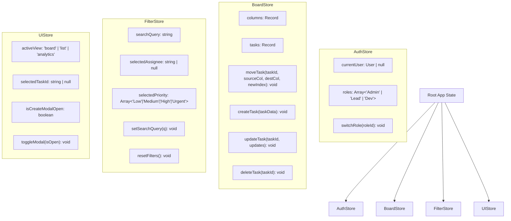

# TaskMatrix — Agile Project Management System
> **Capstone Project Blueprint (Sprint 13 Deliverable)**  
> **Track:** Frontend Specialist  
> **Repository Name:** `prodesk-capstone-taskmatrix`

---

## 📌 Executive Summary & High-Level Description
TaskMatrix is an enterprise-grade Agile Project Management application inspired by Jira and Asana. Designed specifically for software engineering teams, TaskMatrix streamlines sprint planning, task execution, and team collaboration through an intuitive, high-performance user interface.

Key highlights include interactive drag-and-drop Kanban boards, flexible view switches (Board, List, Timeline), task priority & tag management, real-time activity logging, and responsive dark/light UI modes.

---

## 🛠️ Complete Tech Stack

| Domain | Technology / Library | Purpose |
| :--- | :--- | :--- |
| **Framework** | **Next.js 14+ (App Router)** | Modern React Framework with SSR & Static Generation |
| **Language** | **TypeScript** | Type-safe code, props interfaces, and store state validation |
| **Styling & UI** | **Tailwind CSS + Shadcn UI** | Utility-first CSS with accessible, beautiful headless components |
| **State Management** | **Zustand** | Light, predictable, central state management with persistent storage |
| **Drag & Drop** | **`@hello-pangea/dnd` / `dnd-kit`** | Smooth, accessible HTML5 Drag and Drop Kanban interactions |
| **Icons & Assets** | **Lucide React** | Modern vector UI icons |
| **Persistence / Mock API** | **LocalStorage + JSON Mock / MSW** | Instant local state saving & realistic REST payload simulation |

---

## 🚀 Prioritized Core Feature List

### Phase 1: MVP Core Features (Sprint 14 Target)
- [#] **Authentication & User Profile Context**: Mock Role-Based Access Control (Admin, Project Lead, Developer).
- [#] **Drag-and-Drop Kanban Board**: 4 default columns (`To Do`, `In Progress`, `In Review`, `Done`) with reordering and column movement.
- [#] **Task Management (CRUD)**: Create, view detail, edit, and delete tasks with title, description, priority, tags, assignee, and due date.
- [#] **Search & Multi-Filter Bar**: Real-time filtering by search text, assignee, tag, and priority (`Low`, `Medium`, `High`, `Urgent`).
- [#] **Responsive Layout**: Desktop navigation sidebar + Mobile collapsible navigation drawer.

### Phase 2: Advanced Interactive Features (Sprint 15 Target)
- [#] **Task Detail Modal & Subtask Checklist**: Interactive checklist with progress percentage calculation.
- [#] **Activity Log Feed**: Real-time event stream showing task moves, comments, and edits.
- [#] **Board Views**: Toggle between Kanban Board View, Compact Table/List View, and Analytics Summary.
- [#] **Dark / Light Theme Toggle**: Persistent theme switching using `next-themes`.

### Phase 3: AI & Polish (Sprint 16 & 17 Target)
- [#] **AI Task Estimator & Auto-Summarizer**: Smart prompt integrations for generating task summaries and estimating effort.
- [#] **CI/CD & Live Deployment**: Deployed on Vercel with zero console warnings and 95+ Lighthouse score.

---

## 🎨 Phase 2: UI/UX Wireframe Specifications & Figma Link

- **Figma Design File Link:** `https://www.figma.com/design/ZtafCUc7y2pITYtzTCV527/Untitled?node-id=0-1&t=k09BurVGu46xyerq-1`

### Core Viewports Mocked:
1. **Auth & Workspace Switcher Screen**: Clean login view with workspace selection and role preview.
2. **Main Kanban Dashboard View**: 
   - Top Header: Workspace selector, Search input, Filter chips, Add Task button, Profile dropdown.
   - Main Canvas: 4 Kanban columns with task cards displaying priority pills, tags, assignee avatars, subtask counts, and due date badges.
   - Left Sidebar: Navigation links (Dashboard, Board, My Tasks, Activity, Settings).
3. **Task Detail Modal / View**:
   - Expanded modal displaying rich task description, activity history, comment section, assignee picker, priority selector, and subtask progress bar.
4. **Mobile Responsive Viewport**: Bottom nav bar with slide-out drawer for filters and column horizontal scrolling.

---

## 📐 Phase 3: System Architecture — Frontend State Tree & Mock API Spec

### 1. Global State Tree Diagram (Zustand Store)

### 2. Mock API Endpoint Definitions

| Method | Endpoint | Description | Sample Request / Payload |
| :--- | :--- | :--- | :--- |
| `GET` | `/api/v1/board` | Fetch full board layout & tasks | `{ columns: [...], tasks: [...] }` |
| `POST` | `/api/v1/tasks` | Create a new task item | `{ title, description, priority, assigneeId }` |
| `PUT` | `/api/v1/tasks/:id` | Update task details or column position | `{ status: "In Progress", index: 2 }` |
| `DELETE` | `/api/v1/tasks/:id` | Soft-delete a task item | `{ id: "task-102" }` |
| `GET` | `/api/v1/activity` | Fetch recent activity log stream | `[{ id, action, timestamp, user }]` |

---

## 📜 Compliance & AI Policy
Refer to [`Prompts.md`](./Prompts.md) for the complete record of AI prompt engineering queries used during the architecture, PRD drafting, and state tree design phases.
